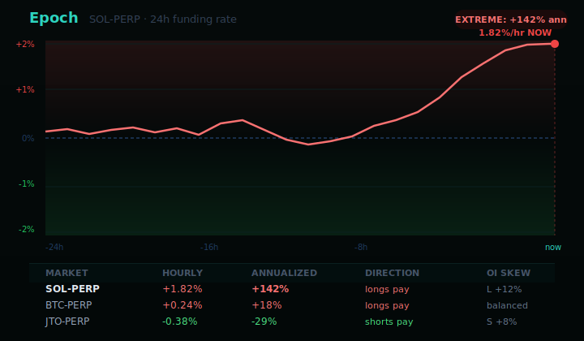
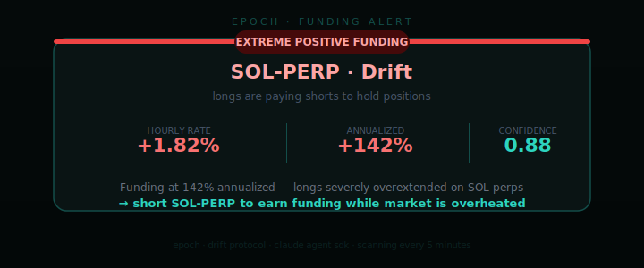

<div align="center">

# Epoch

**Funding-dislocation monitor for Solana perpetual markets.**
Epoch tracks funding regime changes, catches extreme annualized rates, and explains whether the move looks like carry, crowding, or a squeeze setup.

[](https://github.com/EpochFunding/Epoch/actions)

[](https://docs.anthropic.com/en/docs/agents-and-tools/claude-agent-sdk)

</div>

---

Funding is one of the cleanest windows into crowded positioning. When annualized rates get extreme, the market is telling you that one side of the trade is paying too much to stay in control. Epoch turns that signal into an actual monitoring product.

It follows tracked perpetual markets, keeps rolling history, and emits alerts only when the current funding state crosses a threshold that matters. The point is not to print every rate update. The point is to surface the moments when funding becomes a real opportunity or a real warning.

`FETCH -> STORE HISTORY -> TEST EXTREMES -> CLASSIFY -> ALERT`

---

Rate Board - Funding Alert - At a Glance - Operating Surfaces - How It Works - Example Output - Alert Types - Risk Controls - Quick Start

## At a Glance

- `Use case`: monitoring perp funding dislocations on Solana-related markets
- `Primary input`: hourly funding, annualized funding, direction, and recent funding history
- `Primary failure mode`: reacting to a headline rate without context on persistence or recent flips
- `Best for`: operators looking for carry setups, crowding signals, or sentiment shifts in perp markets

## Rate Chart



## Funding Alert



## Operating Surfaces

- `Rate Board`: shows which markets are calm, stretched, or already dislocated
- `History Window`: gives the current rate a trailing context instead of treating every print in isolation
- `Extreme Detector`: flags markets that crossed configured annualized thresholds
- `Alert Layer`: explains whether the move looks like paid carry, crowded leverage, or a sentiment flip worth tracking

## Why Epoch Exists

Funding dashboards already exist. Most of them leave the operator with the same problem as raw price alerts: a number with no ranking and no interpretation. A +90% annualized funding print is not useful if the system cannot tell you whether it is a persistent carry opportunity, a blow-off condition, or a one-off distortion that already reverted.

Epoch exists to make funding operational. It watches the markets that matter, keeps enough history to identify regime shifts, and only emits alerts when the rate structure is strong enough to deserve attention.

## How It Works

Epoch follows a narrow loop:

1. fetch current funding rates for the tracked perp markets
2. append the latest samples to rolling market history
3. compare the current rate against configured extreme thresholds
4. detect sign flips when the recent history actually crossed through zero
5. write an alert that frames the market as carry, stress, or changing sentiment

The system is intentionally selective. A funding board that shouts every five minutes is not a signal product. It is just noise with percentages.

## What A Useful Funding Alert Looks Like

A useful Epoch alert is not "SOL-PERP funding is positive." It is a more precise claim:

- longs are paying an unusually high premium to stay positioned
- the rate has been elevated long enough to matter
- the move either still offers carry or is starting to look structurally crowded
- the market recently flipped sign, which changes how positioning should be read

That is the difference between a tracker and a monitor.

## Example Output

```text
EPOCH // FUNDING ALERT

market             SOL-PERP
annualized rate    +92%
direction          longs pay shorts
alert type         extreme_positive
confidence         0.81

opportunity: funding is rich enough to watch for short-bias carry,
but crowding risk is elevated if the move persists.
```

## Alert Types

| Type | What it means | Typical interpretation |
|------|---------------|------------------------|
| `extreme_positive` | funding is unusually expensive on the long side | short-bias carry or crowded-long warning |
| `extreme_negative` | funding is unusually expensive on the short side | long-bias carry or panic unwind |
| `flip` | funding crossed through zero in recent history | positioning regime changed |

## How Operators Usually Read Epoch

There are two common ways to use the board:

1. as a carry monitor, where the goal is to know when one side is paying an unusually high premium
2. as a positioning monitor, where the goal is to know when sentiment has become lopsided enough to matter for direction

Epoch supports both, but it works best when the operator already knows which of those jobs matters more.

## Risk Controls

- `extreme threshold`: prevents routine funding prints from becoming alerts
- `history-backed flips`: zero-cross alerts only fire when recent samples actually support the regime change
- `confidence floor`: low-quality alerts are demoted before they reach the operator
- `tracked market scope`: the monitor stays focused on named markets instead of pretending to cover everything

Funding should be treated as a state variable, not a guaranteed trade. Epoch is strongest when it is used to frame opportunity and crowding, not as a blind execution trigger.

## Quick Start

```bash
git clone https://github.com/EpochFunding/Epoch
cd Epoch
bun install
cp .env.example .env
bun run dev
```

## Configuration

```bash
ANTHROPIC_API_KEY=sk-ant-...
SCAN_INTERVAL_MS=300000
EXTREME_RATE_THRESHOLD=0.01
ALERT_MIN_CONFIDENCE=0.65
HISTORY_WINDOW_HOURS=24
TRACKED_MARKETS=SOL-PERP,BTC-PERP,ETH-PERP,JTO-PERP,JUP-PERP
```

## License

MIT

---

*funding gets interesting when it stops looking normal.*
